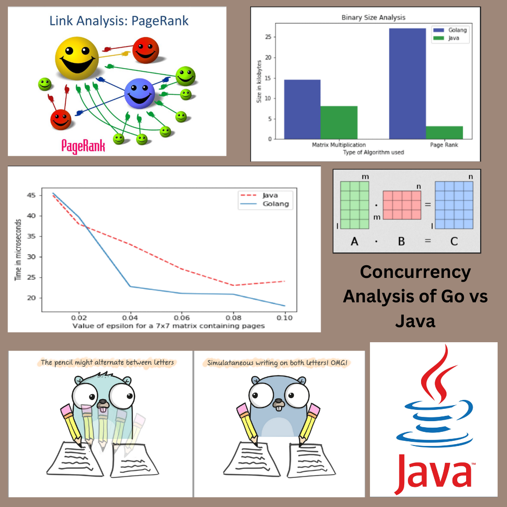

---
title:
layout: default
permalink: /publications/
published: true
---

## Conference Papers

#### 2020
| Publication    | Poster |
| -------- | ------- |
| P. Y. Abhinav, A. Bhat, C. T. Joseph and K. Chandrasekaran, "Concurrency Analysis of Go and Java," 2020 5th International Conference on Computing, Communication and Security (ICCCS), Patna, India, 2020, pp. 1-6, doi: 10.1109/ICCCS49678.2020.9277498. [Link](https://ieeexplore.ieee.org/document/9277498)   |     |

